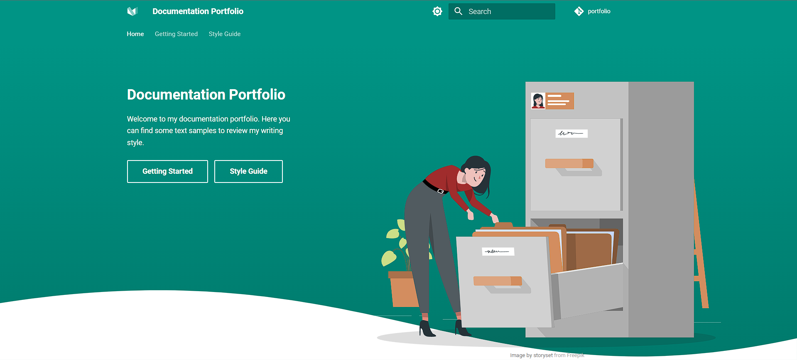

# Readme

Welcome to my documentation text portfolio.



Here you can find some text samples to review my writing style. Follow this guide to set up the project.

## Prerequisites

Make sure you have the following software installed:

- Python
- Git

## Step-by Step

### Setting up the SSH key

Follow these steps to set up your ssh key to work with GitHub:

> *Note*: Skip to [Setting up the project](#setting-up-the-project) if you already have your ssh key set up on GitHub.

1. Open a Command Prompt or Terminal.
2. Run the following command to create a ssh key:

    ```shell
    ssh-keygen -t ed25519 -C your_email@example.com
    ```

3. Hit the Enter key three times to accept the default values for the following:

    - SSH key location directory.
    - Empty SSH security passcode.
    - SSH security passcode confirmation.

4. Open your user folder in one of the following ways:

    - Go to ``C:\Users\`` using your File Explorer and select your user folder (Windows).
    > **Note**: Your Drive letter may be different from ``C``, adjust the path accordingly if necessary.
    - Go to ``$HOME`` using your file explorer and select your user folder (Ubuntu).

5. Open the ``.ssh`` folder.

    > *Note*: You might need to indicate your explorer to show hidden files and folders.

6. Open the ``id_rsa.pub`` file using your preferred IDE or text editor.

    > *Note*: Disregard the default software that Windows suggests to open the file by default.

7. Copy the content of the file.
8. Go to [GitHub](https://github.com/) on your browser.
9. Click on your avatar on the top-right corner.
10. Select **Settings**.
11. Click SSH and GPC keys on the left menu.
12. Click New SSH key.
13. Enter the following information:

    - **Title**: Name for the key.
    - **Key type**: Key type. Keep the value by default.
    - **Key**: Key value. Paste the key you copied from the ``id_rsa.pub`` file.

14. Click **Add SSH key**.

### Setting up the project

Follow these steps to install and run the portfolio locally:

1. Open a folder where you want to store the portfolio files.
2. Open a Command Prompt or Terminal on the folder in one of the following ways:

    - Open the Command Prompt or Terminal and navigate to the folder using the ``cd`` command.
    - Type ``cmd`` on the Address Bar of your File Explorer (Windows).
    - Right-click the folder and select **Open in Terminal** (Ubuntu).

3. Run the following command to clone the repository:

    ```shell
    git clone git@github.com:pablogh89/portfolio.git
    ```

4. Run the following command to open the portfolio folder:

    ```shell
    cd  portfolio 
    ```

5. Run the following command to install the project dependencies (Python packages required to run the project on your device):

    ```shell
    pip install -r requirements.txt
    ```

    > **Note**: If this fails due to access denied, add ``--user`` on Windows or start with ``sudo`` on Linux to solve the problem.

6. Run the following command to install the project template dependencies (Python packages required to run this project template):

    ```shell
    pip install mkdocs-material
    ```

    > **Note**: If this fails, try ``python –m mkdocs serve`` on Windows or ``python3 mkdocs serve`` on Linux to solve the problem.

7. Run the following command to start the portfolio:

    ```shell
    python mkdocs serve 
    ```

    > **Note**: If this fails, try ``python –m mkdocs serve`` on Windows or ``python3 mkdocs serve`` on Linux to solve the problem.

8. The Command Prompt or Terminal displays the following line:

    ```shell
      Serving on http://127.0.0.1:8000/mkdocs-material/
    ```

    That indicates that the project is running on localhost.

    > **Note**: To stop the execution of the project, you can close the Command Prompt or Terminal or press ``Ctrl + C``.

9. Open a browser and navigate to ``http://localhost:8000/``.
